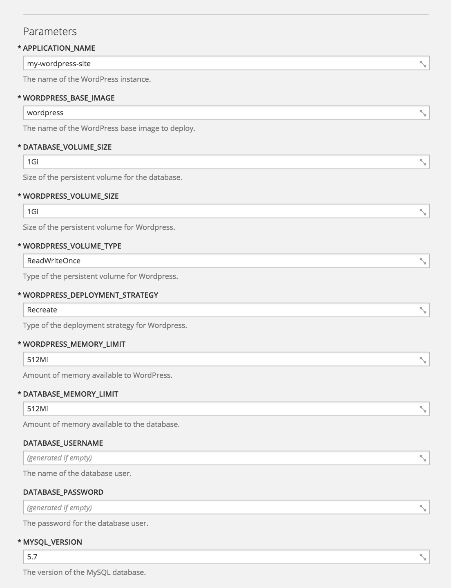

WordPress Quickstart
====================

This repository implements a way of quickly deploying WordPress to OpenShift 3.

Provided in the repository are OpenShift templates for deploying WordPress in a number of different configurations suitable for production and testing environments.

When running, all data related to the WordPress instance is maintained in a persistent volume so it can be updated and changes retained. If the deployment is linked to a repository, you can have updates to plugins, themes and language files copied from a source code repository by re-building the application. This will allow you to keep the code for our own custom plugins and themes under version control.

Fork this Repository First
--------------------------

Before deploying WordPress using this repository, it is recommended that you fork it, then use your copy. This will ensure that you are using a stable version of the scripts and will not be affected by future changes made to this repository. You can update your fork from this repository later if you need future changes which may be made.

To fork the repository, use the **Fork** button on the home page for this repository on GitHub. After creating the fork, modify the templates and change the URL used in them to the repository for your fork. Alternatively, when using the templates, ensure you change the URL in the template parameter to be your fork.

Loading the Templates
---------------------

To load the templates into OpenShift from the command line you can run:

```
oc create -f templates/classic-standalone.json
oc create -f templates/classic-repository.json
```

Alternatively, you can select _Add to Project_ in the OpenShift web console, then _Import YAML/JSON_, and upload the template or cut and paste it into the form. Skip processing the template immediately to load it into the service catalog. The following instructions assume you load it into the service catalog before using it.

Deploying WordPress
-------------------

To deploy a fresh WordPress instance, from the web console select _Add to Project_. Under _Browse Catalog_, select _PHP_. You should be presented with options for the templates you loaded.


Of these options, select _WordPress (Classic / Standalone)_. This option will create an installation of WordPress where everything is self contained within the persistent volume.

The configuration requires two persistent volumes be available. The default persistent volume type used for WordPress data will be _ReadWriteOnce_. This is the type of persistent volume which is normally available in OpenShift clusters hosted on cloud environments such as AWS, Google and Azure. This includes the hosted OpenShift Online service provided by Red Hat.

When this persistent volume type is all that is available, the WordPress instance cannot be scaled and the number of replicas should be left as 1.

If your OpenShift cluster has persistent volumes of type _ReadWriteMany_, you can instead use this persistent volume type. When this persistent volume type is used, you can scale up WordPress to more than 1 replica, and also enable _Rolling_ deployment strategy.

Select _WordPress (Classic / Standalone)_ and you will be presented with a form to fill out details for the WordPress instance to be created.



Change the name of the WordPress instance if desired.

You can optionally set the database username and password. If you do not, these will automatically be filled in with generated values. You can retrieve the values later from the environment settings of the deployment configuration if you need to access the MySQL database directly. You do not need to know the values of the database username and password when doing the deployment.

Click on **Create** to deploy the WordPress instance and return to the _Overview_ in the OpenShift web console.

Configuring WordPress
---------------------

Once WordPress has finished deploying and is running, go to the WordPress site by clicking on the URL on the _Overview_ page of the OpenShift web console. The configuration created will ensure that a secure HTTP connection is used when performing any administration on the WordPress instance, or when logging into the WordPress site.

When the WordPress instance is created, it will be automatically configured with the database credentials to match the MySQL database which was also deployed by the template. Other settings necessary for running under OpenShift will also be automatically setup.

Upon visiting the WordPress site you should therefore bypass the initial setup usually required for WordPress. The first page you should arrive at will be that to select the language to use.


Select the language and click on **Continue**. You will be asked to provide the name for the WordPress instance and details of an initial user.


Fill in your details and click on **Install WordPress**. You will receive confirmation that setup of WordPress has been successful.


You can now log in to your WordPress instance and start using it.

Plugin/Theme Development
------------------------

If you implement your own plugins or themes for WordPress and have them in a hosted Git repository, you can have them automatically deployed with the WordPress site by using the _WordPress (Classic / Repository)_ template. You will be asked to provide a URL for a source repository containing your source code for the plugins and themes. Each time you make changes to your plugins or themes, you can trigger a new build of the WordPress site and they will copied into the site from the source code repository.

Testing Environment
-------------------

If you want to play with WordPress to test out features, validate data migration steps etc, you can use test variants of the templates. These templates can be loaded by running:

```
oc create -f templates/testing-standalone.json
oc create -f templates/testing-repository.json
```

For these configurations, only a single persistent volume is required as the WordPress instance and the MySQL database are run together in the same pod and will share the one persistent volume. With these configurations, you can never scale WordPress up to more than 1 replica, nor enable rolling deployment strategy, even if you have _ReadWriteMany_ persistent volume type available. This restriction exists as scaling up WordPress will also scale up the number of MySQL database instances which would result in database corruption. These configurations are only recommended for testing.
