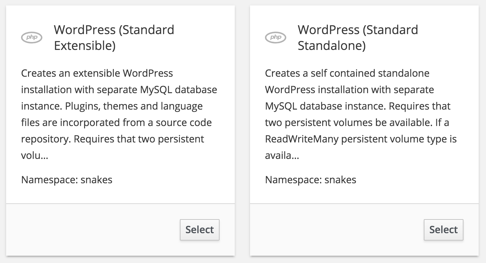
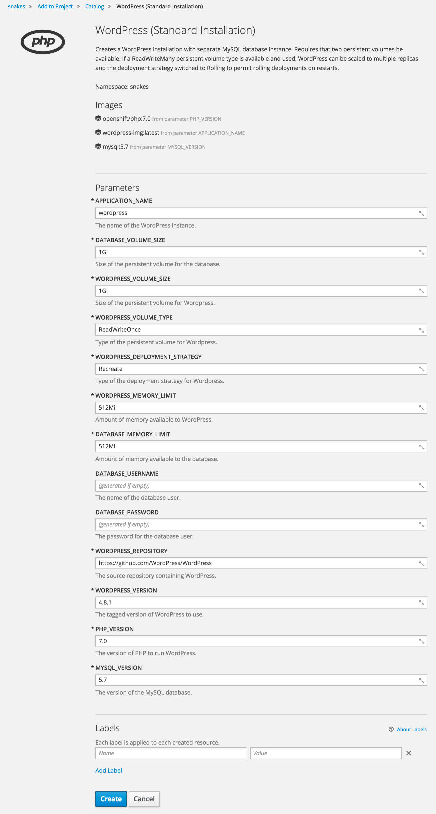
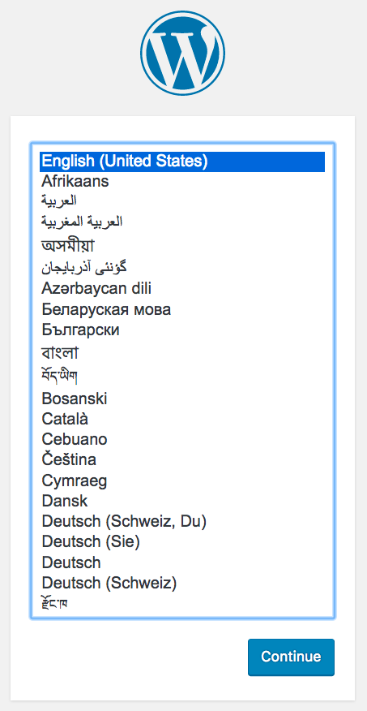
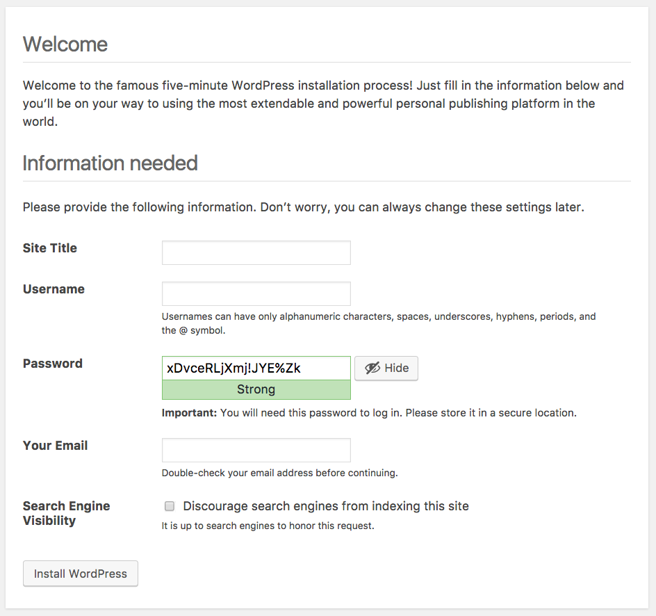
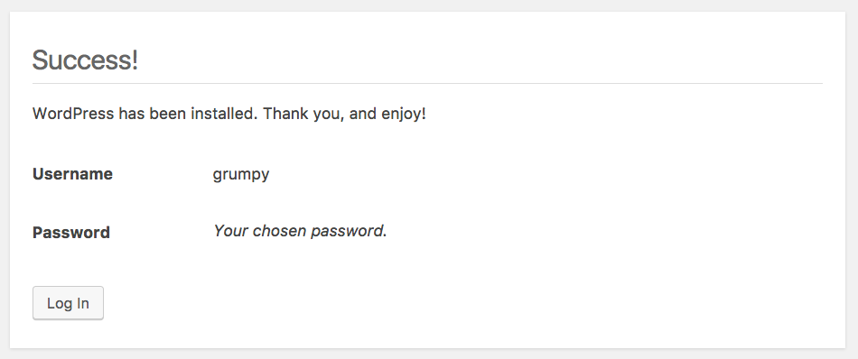

WordPress Quickstart
====================

This repository implements a way of quickly deploying WordPress to OpenShift 3.

Provided in the repository are OpenShift templates for deploying WordPress in a number of different configurations suitable for production and testing environments.

The build configurations created from these templates will pull Source-to-Image (S2I) scripts from this repository which customize the build process for the WordPress application when run through the PHP S2I builder, and the startup process for WordPress when the application is subsequently deployed.

Because the repository contains custom S2I scripts, which will be pulled down every time a re-build of the application image occurs, it is recommended that you create your own fork of the repository, and update your copy of the templates to refer to the scripts from your fork. This will ensure that you are using a stable version of the scripts and will not be affected by future changes made to this repository. You can update your fork from this repository later if you need future changes which may be made.

Forking the Repository
----------------------

To fork the repository, use the **Fork** button on the home page for this repository on GitHub.

Once you have forked the repository, edit the following template files:

* [templates/standard-installation.json](templates/standard-installation.json)
* [templates/testing-environment.json](templates/testing-environment.json)

Search for the ``bc.spec.strategy.sourceStrategy.scripts`` field and change ``openshift-evangelists`` to the name of the GitHub account in which your created the fork of this repository. This will ensure that the S2I scripts are pulled from your copy of the repository.

Loading the Templates
---------------------

To load the templates into OpenShift, you can use the command line or the web console.

On the command line run:

```
oc create -f templates/standard-installation.json
oc create -f templates/testing-environment.json
```

This will create the templates:

```
wordpress-standard-installation
wordpress-testing-environment
```

From the web console select _Add to Project_ and then _Import YAML / JSON_. Upload each template or cut and paste its contents into the form. When asked whether you wish to process the template or update the template, select _Update template_ so that it will be available under _Browse Catalog_ when selecting _Add to Project_.

Deploying WordPress
-------------------

To deploy a fresh WordPress instance, from the web console select _Add to Project_. Under _Browse Catalog_, select _PHP_. You should be present with options for the templates you loaded.



Of these options, you should use _WordPress (Standard Installation)_. This option will create a typical standard installation for running WordPress.

The configuration requires two persistent volumes be available. The default persistent volume type used for WordPress data will be _ReadWriteOnce_. This is the type of persistent volume which is normally available in OpenShift clusters hosted on cloud environments such as AWS, Google and Azure. This includes the hosted OpenShift Online service provided by Red Hat.

When this persistent volume type is all that is available, the WordPress instance cannot be scaled and the number of replicas should be left as 1.

If your OpenShift cluster has persistent volumes of type _ReadWriteMany_, you can instead use this persistent volume type. When this persistent volume type is used, you can scale up WordPress to more than 1 replica, and also enable _Rolling_ deployment strategy.

Select _WordPress (Standard Installation)_ and you will be presented with a form to fill out details for the WordPress instance to be created.



Change the name of the WordPress instance if desired, as well as override the WordPress version and repository from which to pull the WordPress source code.

You can optionally set the database username and password. If you do not, these will automatically be filled in with generated values. You can retrieve the values later from the environment settings of the deployment configuration if you need to access the MySQL database directly. You do not need to know the values of the database username and password when doing the deployment.

Click on _Create_ to deploy the WordPress instance and return to the _Overview_ in the OpenShift web console.

Configuring WordPress
---------------------

Once WordPress has finished building and is running, go to the WordPress site by clicking on the URL on the _Overview_ page of the OpenShift web console. The configuration created will ensure that a secure HTTP connection is used when performing any administration on the WordPress instance, or when logging into the WordPress site.

When the WordPress instance is created, it will be automatically configured with the database credentials to match the MySQL database which was also deployed by the template. Other settings necessary for running under OpenShift will also be automatically setup.

Upon visiting the WordPress site you should therefore bypass the initial setup usually required for WordPress. The first page you should arrive at will be that to select the language to use.



Select the language and click on **Continue**. You will be asked to provide the name for the WordPress instance and details of an initial user.



Fill in your details and click on **Install WordPress**. You will receive confirmation that setup of WordPress has been successful.



You can now log in to your WordPress instance and start using it.

Testing Environment
-------------------

If you want to play with WordPress to test out features, validate data migration steps etc, you can use the _WordPress (Testing Environment)_ template. In this configuration, only a single persistent volume is required as the WordPress instance and the MySQL database are run together in the same pod and will share the one persistent volume. In this configuration, you can never scale WordPress up to more than 1 replica, nor enable rolling deployment strategy, even if you have _ReadWriteMany_ persistent volume type available. This restriction exists as scaling up WordPress will also scale up the number of MySQL database instances which would result in database corruption. This configuration is only recommended for testing.
